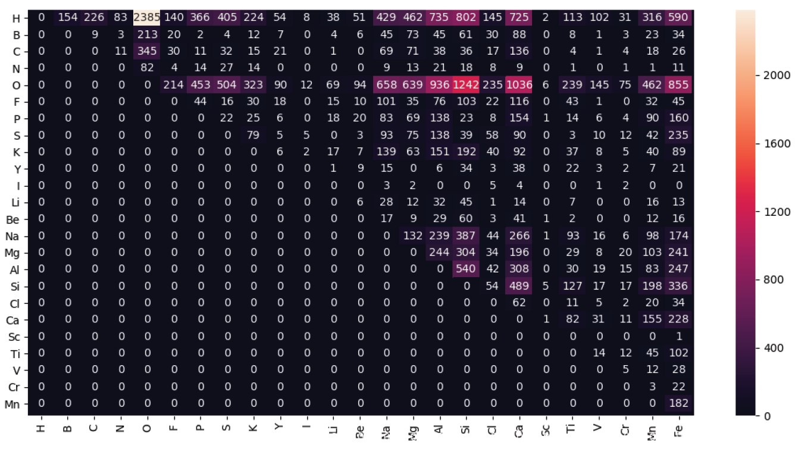
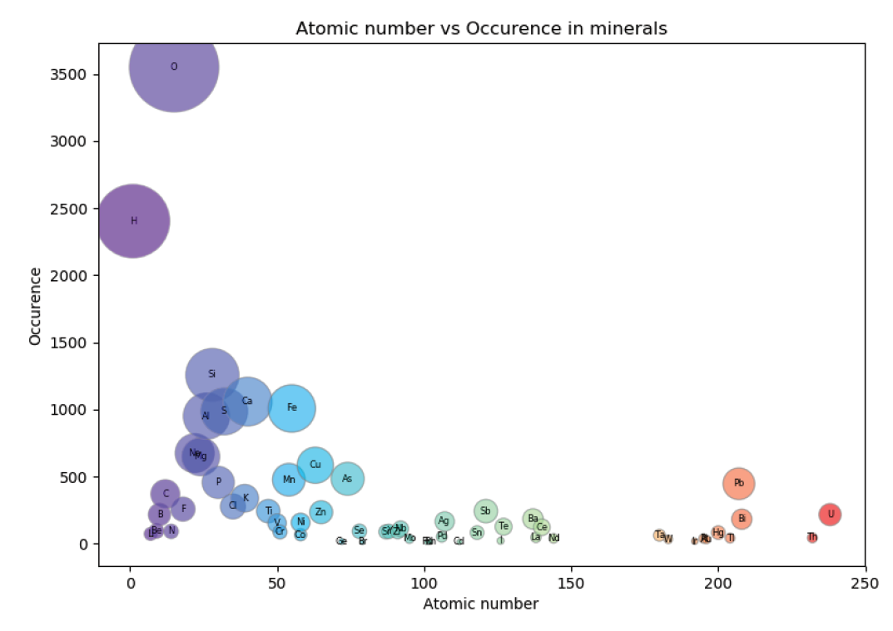
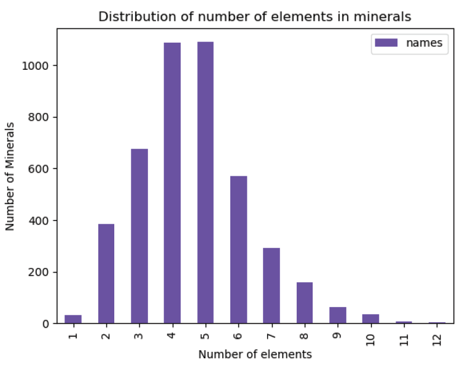
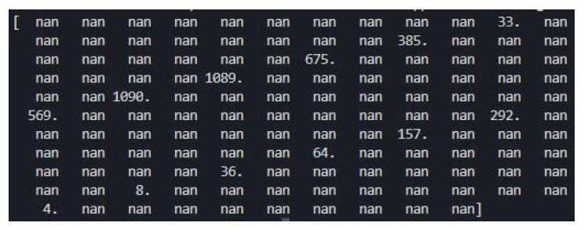
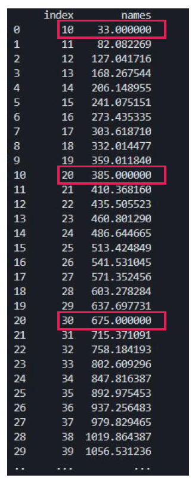
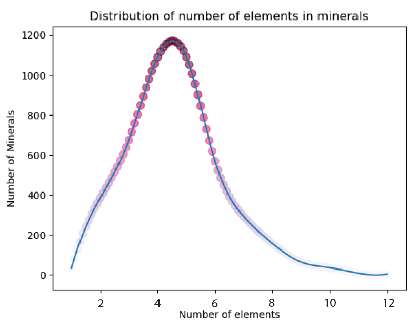

# **Analysis of element occurence in minerals**
Forms the basis of the dashboard page for Crystallizer React app.

You can visit the deployed app at https://xandrav.github.io/crystallizer/.

### Methods Used
* Data Visualization
* Data Manipulation
* Web Data Scraping

### Technologies
* Python Request library
* Matplotlib, Chart Studio Plotly, Seaborn
* Numpy, Pandas

## Getting Started

1. Install python and the relevant libraries (see below in resources)
2. Clone this repo
3. Inside the project folder run `python filename.py`

## Project 1 - *Heatmap*
### Objective
1. Find out what native element pairs occure the most often in minerals and visualise the result as a heatmap.

## Process
1. Collected chemical structures of 4404 mineral from from https://www.mindat.org using Python Request library.
2. Wrote search function and a method to find the number of link representing the number of minerals containing an element pair.
3. Converted the result into a matrix that can be visualised as a heatmap. 

*The white square in the upper left corner is the hydrogen - oxygen pair meaning that both of these elements can be found together in most minerals.*

## Project 2 - *Bubble Chart*
### Objective
1. Find out what native element occures the most often in minerals and visualise the result versus the atomic number of the elements.

## Project 3 - *Line and Bar Charts*
### Objective
1. Find out how many distinct elements minerals contain on average.

## Process
1. Collected chemical structures of 4404 mineral that I stored in a csv file. For this analysis I converted the csv into a json where each object has two fields: name and an array of individual elements the mineral contains.
2. Wrote a function to count how many distinct elements each mineral contains and groupped the data by count.

3. Then I created a simple bar chart to plot the data.

4. To plot this using line graph we need more data points.
Created an array of 130 NaN and substituted the original data into every 10th value of this array. 

5. Interpolated the rest of the data ie. generated data for the missing values (NaNs), preserving the original data. 

6. Plotted the new dataframe object with interpolated data.

## Resources
| Description | Link     |
| :------------- | :------------- |
| mindat.org - online database of minerals | [Mindat](https://www.mindat.org/)|
| Requests - HTTP library for Python       | [Python Requests](https://requests.readthedocs.io/en/master/) |
| NumPy - package for scientific computing with Python  | [Numpy docs](https://numpy.org/) |
| Pandas - data analysis tool | [Pandas docs](https://pandas.pydata.org/) |
| Matplotlib - 2D plotting library | [Matplotlib](https://matplotlib.org/)|
| Chart Studio Plotly - graphing library for quality graphs| [Chart Studio](https://plot.ly/python/getting-started-with-chart-studio/)|
| Seaborn - interface for drawing statistical graphics | [Seaborn](https://seaborn.pydata.org/)|

